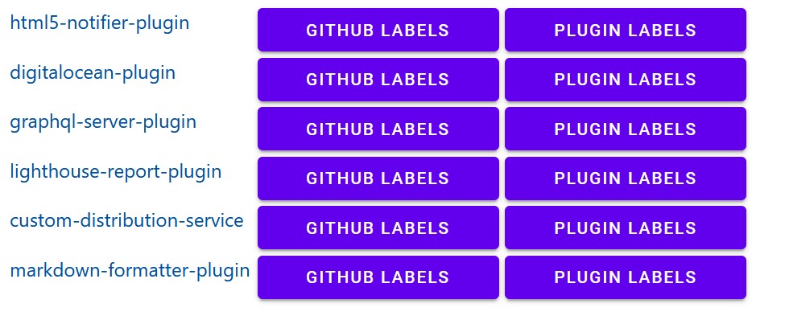
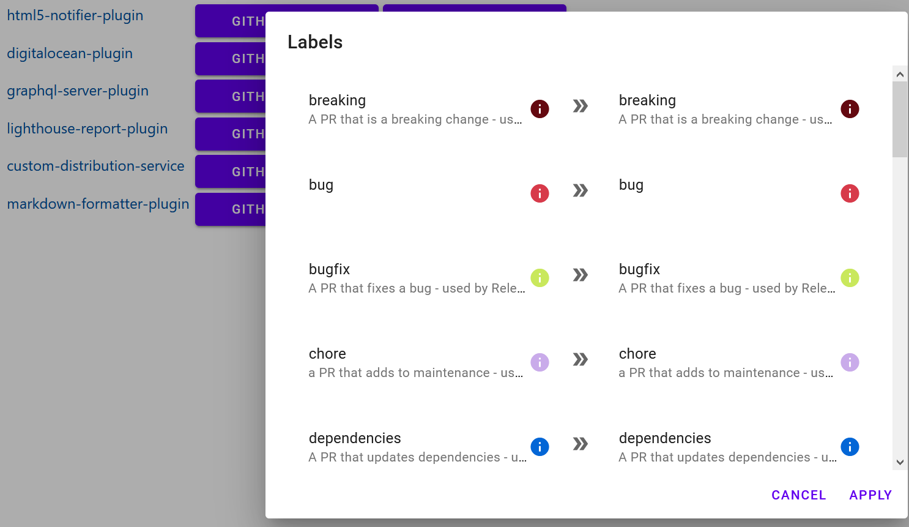
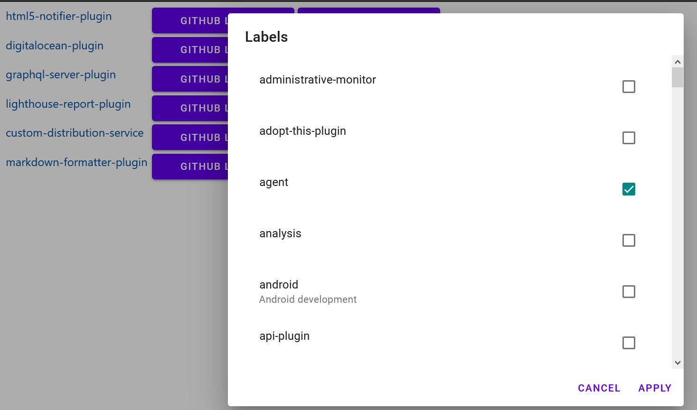

# plugins-self-service

[](https://cloud.digitalocean.com/apps/new?repo=https://github.com/halkeye/plugins-self-service/tree/master)

Little app to manage some once in a while tasks for plugin maintainers

## Screenshots







## Running

### Installing

```npm install```

### Running

```
export GITHUB_CLIENT_ID=<app client id>
export GITHUB_CLIENT_SECRET=<app client secret>
npm run start
```

## Development

### Installing

```npm install```

### Running

```
export GITHUB_CLIENT_ID=<app client id>
export GITHUB_CLIENT_SECRET=<app client secret>
npm run dev
```
